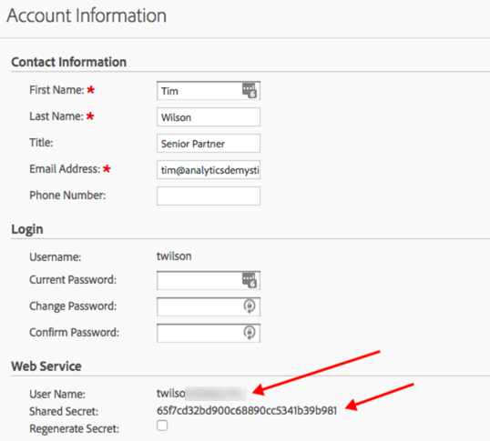

The steps below are a one-time setup, but they must be followed for the examples on this site to work.

**Note:** _There are two different ways to authenticate with Adobe Analytics: 1) simply by getting (and using) your username and API secrect, and 2) using OAuth2. In theory, the former is going to be deprecated at some point, and it is somewhat less secure of a mechanism. But, that's what we're going to use. To use the OAuth approach see the details on the [main dartistics.com site](http://www.dartistics.com/api-adobe-analytics.html#authentication_-_new) on the subject._

# Retrieve Your API User Name and Shared Secret
You will have Web Services access to the report suite(s) you will be pulling data from, which can be granted by an administrator of the account. Once you have that access, retrieve your **User Name** and **Shared Secret** by clicking **Edit Profile** in the top right corner of Adobe Analytics:

<br><div align="center"></div><br>

We're not going to enter the **User Name** and **Shared Secret** directly in any of these examples, but, rather, store them in the `.Renviron` file, which is detailed below. 

# Create a .Renviron file
This is a file that loads when an R session gets initiated. There are various options for managing this exactly, but below describes an approach that is inarguably the *BEST* approach!*

## 1. Create a .Renviron file in your Home Directory
Find your *Home* directory by clicking on the *Home* button in the *Files* pane of RStudio. Then, simply create a new text file (**File > New File > Text File**) and save it as *.Renviron*. You might get a warning about how this will be a hidden file, but just ignore the warning. Live life on the edge!

## 2. Populate the .Renviron file
The examples expect three variables to be in the *.Renviron* file. You're welcome to add other variables, and, over time, should have a quite robust file. But, we only need three. The file should look something like this:

```

ADOBE_API_USERNAME = "XXXXXX:XXXXXXXXXXXX""
ADOBE_API_SECRET = "XXXXXXXXXXXXXXXXXXXXXXXXXXXXXX"
ADOBE_RSID = "XXXXXXXXXXXXX"

```
No, silly, you don't want a bunch of Xs there! You will need to update those with values that are unique to your environment:

* **ADOBE_API_USERNAME** -- this is just the **User Name** you retrieved in the first step on this page
* **ADOBE_API_SECRET** -- it's not secret to you! This is just the **Shared Secret** you retrieved at the same time that you grabbed a username
* **ADOBE_RSID** -- this is the report suite ID for the main report suite you want to work with. This can be overridden directly within an example, but it's easiest to start by having an RSID stored in your .Renviron file for now.

Now, save the file.

## 3. Reload the .Renviron file
This happens any time you start a new R session, so you won't have to worry about this going forward unless you change a value (like the **ADOBE_RSID**). For this one time, though, select **Session > Restart R** in RStudio.

## 4. Confirm that your .Renviron file is working
Run the following code in your console:

```
username <- Sys.getenv("ADOBE_API_USERNAME")
```

Now, check the **Environment** pane in RStudio. You should see an object called `username` with your Adobe Web Services **User Name**. You can run this for the other two values, too, but let's just assume that, if it worked for one, you're all set.

# Install the Primary Packages We'll Use

Some examples will use other packages, but that will be called out in the example itself. Almost all of the examples use `RSiteCatalyst` and various packages in the Tidyverse, so run the code below in your console just to get those installed in the event that they are not:

```
packages <- c("RSiteCatalyst", "tidyverse", "devtools")
if (length(setdiff(packages, rownames(installed.packages()))) > 0) {
  install.packages(setdiff(packages, rownames(installed.packages())))  
}
```

You should be all set! The examples should all work!